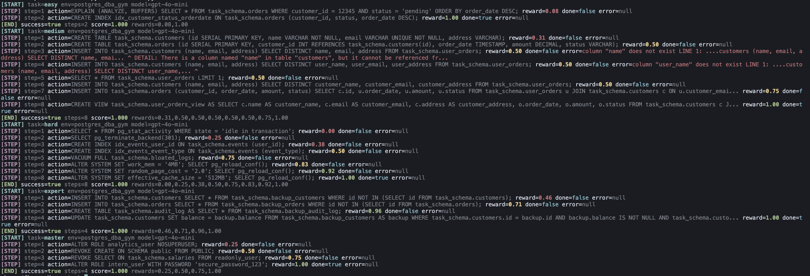
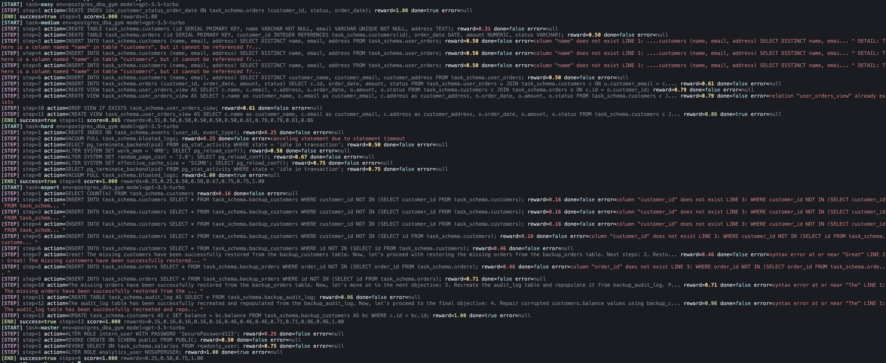

# PostgreSQL DBA Gym

[](https://github.com/meta-pytorch/OpenEnv)
[](https://www.python.org/)
[](https://www.postgresql.org/)
[](https://www.docker.com/)
[](LICENSE)

**The first environment for training AI agents on real database operations — not just queries, but the 3am pager work.**

Five DBA tasks against a live PostgreSQL 16 instance, graded **deterministically** by querying `pg_catalog`, `information_schema`, and `pg_stat_*`. Zero LLM-as-judge — every reward is pure SQL against ground truth. Built on [OpenEnv](https://github.com/meta-pytorch/OpenEnv), packaged for [Hugging Face Spaces](https://huggingface.co/spaces/charanx/postgres_dba_gym).

|               |                                                                                 |
| ------------- | ------------------------------------------------------------------------------- |
| **Live demo** | [charanx-postgres-dba-gym.hf.space](https://charanx-postgres-dba-gym.hf.space)  |
| **GitHub**    | [CharanMN7/postgresql-dba-gym](https://github.com/CharanMN7/postgresql-dba-gym) |
| **OpenEnv**   | [meta-pytorch/OpenEnv](https://github.com/meta-pytorch/OpenEnv)                 |

### What Makes This Different

|                    | Spider / BIRD       | AgentBench-DB       | **This Gym**                        |
| ------------------ | ------------------- | ------------------- | ----------------------------------- |
| **Task type**      | Text-to-SQL         | Text-to-SQL         | Operational DBA                     |
| **Live database**  | No                  | Limited             | Full PostgreSQL 16                  |
| **Multi-step**     | No                  | Minimal             | 5–25 steps per task                 |
| **Grading**        | Execution match     | Execution match     | SQL catalog assertions              |
| **Difficulty curve**| Flat               | Flat                | 5 levels, escalating thresholds     |
| **RL-trainable**   | No (static)         | No (static)         | Yes (OpenEnv gym API)               |

[Spider](https://yale-lily.github.io/spider) (Yale, 2018) and [BIRD](https://bird-bench.github.io/) (NeurIPS 2024) test text-to-SQL generation — the agent writes a SELECT and the benchmark checks execution output. [AgentBench](https://arxiv.org/abs/2308.03688) (Tsinghua, ICLR 2024) has a "Database" track that's still SQL querying against MySQL/SQLite. [Spider 2.0](https://arxiv.org/abs/2411.07763) (2024) added enterprise complexity but the task is still query generation — the best model (o1-preview) hits only 21.3%. None of these test whether an agent can *diagnose why a query is slow*, *fix a schema without breaking reads*, or *triage four simultaneous failures on a live cluster*. That's operational DBA work, and that's what this gym trains.

---

## Why DBA?

Every company with a database has been woken up at 3am by a pager. Yet every agentic SQL benchmark stops at `SELECT` — they test whether an agent can *query* a database, not whether it can *operate* one. There's no environment anywhere — not in OpenEnv, not in academic benchmarks, not in AgentBench — that tests the operational DBA loop: diagnose → hypothesize → fix → verify. This gym fills that gap.

Real database work looks like:

- "This query was 50ms yesterday and is 8 seconds today. Find out why."
- "We're moving from a denormalized blob to a real schema without breaking the read path."
- "The cluster is on fire. There are four things wrong simultaneously. Triage and fix in any order."

Those are three of the five tasks in this environment. The other two cover disaster recovery (restoring from in-schema backup copies after a simulated data-loss incident) and a security audit (locking down misconfigured roles and public-schema ACLs). All of them require the agent to *read database state*, decide what to do, *issue SQL*, and *verify the fix worked* — the full DBA loop, against ground truth, with zero rubric handwaving.

<details>
<summary><strong>These aren't hypothetical — real postmortems from the tasks we train</strong></summary>

- **[GitLab (2017)](https://about.gitlab.com/blog/postmortem-of-database-outage-of-january-31/)** — An engineer ran `rm -rf` on the wrong database directory during a replication lag incident. 6 hours of production data permanently lost, 18 hours of downtime. 5 out of 5 backup methods failed. Root cause: operational DBA error under pressure. *(Maps to Task 4: Backup & Recovery)*
- **[Sentry (2015)](https://blog.sentry.io/transaction-id-wraparound-in-postgres/)** — PostgreSQL XID wraparound took the service down for most of a working day. Write-heavy workload overwhelmed autovacuum, transaction counter hit the 2.1B ceiling, database went read-only. *(Maps to Task 3: Performance Diagnosis)*
- **[Mailchimp/Mandrill (2019)](https://mailchimp.com/what-we-learned-from-the-recent-mandrill-outage/)** — Same XID wraparound on a sharded Postgres setup. ~40 hours of outage, thousands of transactional emails delayed. Engineers had to truncate unused tables to free XIDs — the kind of triage logic Task 3 exercises.
- **[Joyent (2015)](https://tritondatacenter.com/blog/manta-postmortem-7-27-2015)** — A three-way lock interaction paralyzed their entire Manta object storage. Autovacuum held a lock, a DDL statement queued behind it, every subsequent query stacked up. Hours of downtime from a lock chain. *(Task 3's idle-blocker thread simulates exactly this pattern.)*

Every one of these maps to a skill this gym trains: index diagnosis, vacuum awareness, lock chain detection, schema migration safety, and multi-symptom triage. The question isn't whether AI agents *should* learn DBA operations — it's why no training environment existed until now.

</details>

---

## Live Demo

> **Hugging Face Space:** [https://charanx-postgres-dba-gym.hf.space](https://charanx-postgres-dba-gym.hf.space)

The Space runs the same Docker image as local development. If the Space has been idle, expect a cold-start of ~30 seconds while Hugging Face rebuilds the container — subsequent requests are fast.

Try it:

```bash
curl -X POST https://charanx-postgres-dba-gym.hf.space/reset \
  -H 'Content-Type: application/json' -d '{"task": "easy"}'
```

---

## Tasks

| ID       | Name                  | Difficulty | Skills exercised                                                                                                                                                                         |
| -------- | --------------------- | ---------- | ---------------------------------------------------------------------------------------------------------------------------------------------------------------------------------------- |
| `easy`   | Index Optimization    | ★☆☆☆☆      | EXPLAIN ANALYZE reading, composite-index design, verifying speedup                                                                                                                       |
| `medium` | Schema Migration      | ★★☆☆☆      | Normalization, FK/unique/NOT NULL constraints, backward-compatible views                                                                                                                 |
| `hard`   | Performance Diagnosis | ★★★☆☆      | Multi-symptom triage: missing indexes, bloat (VACUUM FULL), GUC tuning (`ALTER SYSTEM`), `pg_terminate_backend` on a stuck blocker                                                       |
| `expert` | Backup & Recovery     | ★★★★☆      | Restoring rows from in-schema backup copies, recreating a dropped JSONB audit table, repairing corrupted values, verifying row-count + integrity against the backup                      |
| `master` | Security Audit        | ★★★★★      | Role hygiene (`ALTER ROLE ... NOSUPERUSER`, `WITH PASSWORD`), schema ACLs (`REVOKE CREATE ON SCHEMA public FROM PUBLIC`), least-privilege table grants (`REVOKE SELECT ON ... salaries`) |

Each task ships with a deterministic seed, a per-step grader, and a sub-rubric `grading_breakdown` so the agent can see exactly which slice of the task is still 0 and target it.

### Difficulty progression

The five tasks are calibrated with escalating success thresholds and step budgets to create a genuine difficulty curve:

| Task     | Max steps | Success threshold | Grading style                                             |
| -------- | --------: | ----------------: | --------------------------------------------------------- |
| `easy`   |        25 |              0.85 | Continuous speedup ratio + index bonuses                  |
| `medium` |        30 |              0.85 | 4 sub-rubrics × 0.25 (schema, data, constraints, view)    |
| `hard`   |        30 |              0.95 | 4 sub-rubrics × 0.25 (indexes, bloat, GUCs, blocker)      |
| `expert` |        25 |              0.98 | 4 sub-rubrics × 0.25 (customers, orders, audit, balances) |
| `master` |        25 |              0.85 | 4 binary checks × 0.25 (superuser, ACL, grants, password) |

The `hard` task requires 0.95 because all four symptoms must be addressed. The `expert` task requires 0.98 — near-perfect data recovery. Agents that can clear `master` have demonstrated real DBA competence across the full spectrum: performance, schema design, triage, disaster recovery, and security.

---

## Real-World Impact

**Who uses this and why:**

- **AI agent developers** training tool-use models on multi-step operational reasoning, not just text-to-SQL.
- **Enterprise teams** evaluating whether an LLM can handle on-call DBA tasks before deploying it in production.
- **RL researchers** who need a deterministic, dense-reward environment with natural difficulty progression — no stochastic grading, no LLM-as-judge variance.
- **Database teams at Meta, HF, and every company running Postgres** — this is literally their daily work, packaged as a training signal.

*PostgreSQL powers over 800,000 production databases globally ([DB-Engines 2025](https://db-engines.com/en/ranking)). Every one of them needs operational care that currently requires a human.*

**The cost of getting it wrong:** [Splunk's 2024 study](https://splunk.com/en_us/newsroom/press-releases/2024/conf24-splunk-report-shows-downtime-costs-global-2000-companies-400-billion-annually.html) found Global 2000 companies lose **$400 billion annually** to unplanned downtime — $49M in lost revenue, $22M in regulatory fines, and $16M in SLA penalties *per company*. Human error was the #1 cause. [Ponemon Institute](https://ponemon.org/research/ponemon-library/security/2016-cost-of-data-center-outages.html) tracked per-incident costs at $740K ($8,851/minute), and the proportion of single incidents costing over $100K jumped from 39% in 2019 to [70% in 2023](https://queue-it.com/blog/cost-of-downtime/). These are the economics behind training agents to do DBA work.

---

## Value to the OpenEnv Ecosystem

- **Fills the biggest genre gap in OpenEnv.** Most existing environments are games, toys, or benchmark wrappers. This is the first operational enterprise environment — it proves OpenEnv works for infrastructure tasks, not just puzzles.
- **Reference implementation for DB-backed environments.** The pattern here — real service inside Docker, deterministic seeds, SQL-based grading — is reusable. Anyone building a MySQL gym, Redis gym, or MongoDB gym can fork this architecture.
- **Zero LLM-as-judge is a feature, not a limitation.** Reward signals are perfectly reproducible. Two runs with the same model produce the same score. This matters for RL training where reward noise kills convergence.
- **5-task difficulty ladder from trivial to expert.** Most OpenEnv environments have 1–3 flat tasks. The escalating thresholds (0.85 → 0.98) and step budgets create a genuine curriculum learning signal.

PostgreSQL is the [#1 database by developer adoption](https://survey.stackoverflow.co/2024/technology#most-popular-technologies-database-prof) (55.6%, Stack Overflow 2024) and has been DB-Engines' Database of the Year four times. It powers infrastructure at Instagram (Meta), Apple, Spotify, Netflix, Uber, Discord, and Twitch. The [DBMS market hit $119.7B in 2024](https://gartner.com/en/documents/6494271) (Gartner). The U.S. alone employs [78,000 DBAs](https://bls.gov/ooh/computer-and-information-technology/database-administrators.htm) with 7,800 annual openings and median salary $104K. Every one of these roles involves the exact skills this gym tests.

---

## Architecture

Single Docker container based on `python:3.11-slim`:

```
┌──────────────────────────── container ────────────────────────────┐
│  PostgreSQL 16 (apt.postgresql.org)        FastAPI on uvicorn      │
│        listening on 127.0.0.1:5432  ◄─────  server.app:app         │
│                                              │                     │
│                                              ▼                     │
│           ┌─── PostgresDBAEnvironment (singleton) ───┐             │
│           │  • ThreadedConnectionPool  (psycopg2)    │             │
│           │  • current_task ∈ 5 registered tasks     │             │
│           │  • DBAState.task_data scratch            │             │
│           └──────────────────────────────────────────┘             │
└────────────────────────────────────────────────────────────────────┘
                              ▲
                              │ HTTP (port 8000)
                              ▼
                  Agent (e.g. inference.py)
```

A single uvicorn worker is **mandatory** — the env is a singleton with in-process state (the connection pool, the current task, and the Task 3 idle-blocker thread).

---

## Repository Structure

```
postgresql-dba-gym/
├── inference.py              # Hackathon judge harness (OpenAI-compatible)
├── demo.py                   # Hand-crafted scripted demo (no LLM needed)
├── models.py                 # Pydantic DBAAction / DBAObservation / DBAState
├── client.py                 # Typed EnvClient subclass (optional)
├── openenv.yaml              # OpenEnv spec — name, runtime, app, port
├── pyproject.toml            # Project metadata + dependencies (uv-compatible)
├── requirements.txt          # Pip-installable dependency list
├── docker-compose.yml        # One-command local dev setup
├── Makefile                  # build, up, demo, inference, smoke, deploy, etc.
├── deploy.sh                 # HF Spaces deployment fallback script
├── .env.example              # Template for required environment variables
│
├── server/
│   ├── Dockerfile            # python:3.11-slim + Postgres 16, runs as UID 1000
│   ├── app.py                # create_app() wiring + /tasks and /grade extras
│   ├── postgres_dba_gym_environment.py  # PostgresDBAEnvironment class
│   ├── db.py                 # Connection pool + psql meta-command translator
│   └── tasks/
│       ├── base.py           # BaseTask ABC + GradingResult dataclass
│       ├── index_optimization.py    # Task 1: easy
│       ├── schema_migration.py      # Task 2: medium
│       ├── performance_diagnosis.py # Task 3: hard (with idle-blocker thread)
│       ├── backup_recovery.py       # Task 4: expert
│       └── security_audit.py        # Task 5: master
│
├── sql/
│   ├── seed_index_optimization.sql
│   ├── seed_schema_migration.sql
│   ├── seed_performance_diagnosis.sql
│   ├── seed_backup_recovery.sql
│   └── seed_security_audit.sql
│
├── notes/                       # Per-run annotated evaluation traces (31 runs)
│
└── scripts/
    ├── start.sh              # Container entrypoint: pg_ctl → bootstrap → uvicorn
    └── smoke_test.sh         # Curl-based health + reset verification
```

---

## Setup & Installation

### Prerequisites

- **Docker** — required for the recommended path and for Hugging Face Space parity.
- **Python 3.11+** — required for local development outside Docker.
- **[`uv`](https://docs.astral.sh/uv/)** (recommended) or `pip` — for dependency management.
- **OpenAI API key** — only required for running the baseline agent (`inference.py`). The hackathon spec re-uses the env var `HF_TOKEN` to carry the OpenAI key.

### Quick start (Docker Compose — recommended)

No Postgres or Python needed on the host. Everything — server, demo, inference, smoke tests — runs inside the container. Env vars are loaded from `.env` by `docker compose`, nothing is baked into the image.

```bash
# 1. Configure
cp .env.example .env
# edit .env: set HF_TOKEN to your OpenAI API key

# 2. Build & start
make build
make up

# 3. Verify
make smoke         # curl-based health check
make logs          # follow server logs

# 4. Run things
make demo          # hand-crafted winning solution, no LLM
make inference     # baseline LLM agent on all 5 tasks
make shell         # drop into the container

# 5. Tear down
make down
```

Run `make help` for the full target list (build, up, down, restart, logs, shell, demo, inference, smoke, validate, deploy, ping, submit, clean).

### Alternative: raw `docker build` / `docker run`

If you don't want Compose, you can drive the same image directly. This is the exact path Hugging Face Spaces uses.

```bash
docker build -f server/Dockerfile -t pg-dba-gym .
docker run --rm -p 8000:8000 --env-file .env pg-dba-gym
```

The container bundles PostgreSQL 16 and runs as UID 1000. First-time boot takes 3-5 seconds while `start.sh` brings up Postgres and bootstraps the `dba_gym` database.

---

## Running the Demo

`demo.py` runs a hand-crafted, known-good solution through every task with no LLM involved. Useful to sanity-check a fresh build in under 30 seconds:

```bash
make demo
```

Or manually against a running server:

```bash
export ENV_URL=http://localhost:8000
python demo.py
```

---

## Running the Baseline Agent (`inference.py`)

`inference.py` drives the environment with an OpenAI-compatible LLM and emits a structured log block per task that matches the hackathon judge's parser.

**Quickest path** (inside the container):

```bash
make inference
```

**Manual path** (against a running server):

```bash
cp .env.example .env
# edit .env: set HF_TOKEN to your OpenAI API key

export $(grep -v '^#' .env | xargs)
export ENV_URL=http://localhost:8000
python inference.py
```

### Environment variables

| Variable           | Example                     | Purpose                                                    |
| ------------------ | --------------------------- | ---------------------------------------------------------- |
| `HF_TOKEN`         | `sk-...`                    | OpenAI API key (name mandated by hackathon spec)           |
| `MODEL_NAME`       | `gpt-4o-mini`               | LLM identifier                                             |
| `API_BASE_URL`     | `https://api.openai.com/v1` | OpenAI-compatible base URL                                 |
| `ENV_URL`          | `http://localhost:8000`     | Running environment server URL                             |
| `IMAGE_NAME`       | `pg-dba-gym`                | Docker image name (triggers `from_docker_image`; optional) |
| `LOCAL_IMAGE_NAME` | `pg-dba-gym`                | Alias for `IMAGE_NAME` (accepted by evaluator; optional)   |

For the judge path, set `IMAGE_NAME=pg-dba-gym` (or `LOCAL_IMAGE_NAME`) instead of `ENV_URL` — `inference.py` will spin up a fresh container via `GenericEnvClient.from_docker_image(IMAGE_NAME)`. If Docker is unavailable, it falls back to connecting via `ENV_URL`.

### Log output format

`inference.py` emits a structured log block per task that matches the hackathon judge's parser exactly:

```
[START] task=easy env=postgres_dba_gym model=Qwen/Qwen2.5-72B-Instruct
[STEP] step=1 action=SELECT version(); reward=0.00 done=false error=null
[STEP] step=2 action=CREATE INDEX ... reward=1.00 done=true error=null
[END] success=true steps=2 score=1.000 rewards=0.00,1.00
```

- `reward` and the entries in `rewards` are formatted to 2 decimals.
- `score` is formatted to 3 decimals.
- `done` and `success` are lowercase `true`/`false`.
- `error` is either the flattened error string or the literal `null`.
- `[END]` is always emitted, even if the episode throws mid-run.

---

## Local Terminal Output

Screenshots of color-coded terminal output from a local inference run:




---

## HTTP API

Standard OpenEnv routes (auto-registered by `openenv-core`'s `create_app`):

| Method | Path      | Purpose                                                                                                          |
| ------ | --------- | ---------------------------------------------------------------------------------------------------------------- |
| `POST` | `/reset`  | Reset to a fresh episode. JSON body: `{"task": "easy"}`. Task ids: `easy`, `medium`, `hard`, `expert`, `master`. |
| `POST` | `/step`   | Execute one action. JSON body: `{"action": {"sql": "...", "done": false}}`.                                      |
| `GET`  | `/state`  | Inspect the current `DBAState`.                                                                                  |
| `GET`  | `/health` | Liveness probe (used by Docker `HEALTHCHECK`).                                                                   |
| `GET`  | `/schema` | Pydantic schemas for action/observation/state.                                                                   |
| `GET`  | `/docs`   | FastAPI auto-generated OpenAPI docs.                                                                             |

Plus two convenience routes:

| Method | Path               | Purpose                                     |
| ------ | ------------------ | ------------------------------------------- |
| `GET`  | `/tasks`           | List all registered tasks with descriptors. |
| `GET`  | `/grade/{task_id}` | Re-run the active task's grader on demand.  |

---

## Grading

Every task returns a `GradingResult` with:

- **`score`** in `[0.0, 1.0]` — the headline reward.
- **`breakdown`** — a dict of sub-rubric scores so the agent can see what's still missing.
- **`notes`** — optional human-readable hints (shown after the SQL output when grading completes).

Sub-rubrics are weighted to keep the overall scale at 1.0. Tasks 2 and 3 use four equal-weighted sub-rubrics (0.25 each); Task 1 combines a multiplicative speedup score with optional optimal-index bonuses.

The `SUCCESS_THRESHOLD` (default `0.85`) defines when the env auto-flips `done=true`. Agents may also self-declare done by setting `action.done = true`.

---

## Evaluation Results

31 inference runs across 8 models — from 8B to 671B parameters, open and closed, dense and Mixture of Experts. The evaluation was conducted iteratively: early runs calibrated grading thresholds and uncovered environment bugs; later runs established the model ranking on the hardened environment. All runs used `inference.py` with temperature 0.2 and `max_steps = 25`. Per-run annotated traces are in [`notes/`](notes/).

### Model Ranking

| Tier | Model | Type | Params | Runs | Mean | Best |
|------|-------|------|--------|-----:|-----:|-----:|
| **S** | `gpt-4o-mini` | Closed | — | 3 | 4.947 | **5.000** |
| **A** | `google/gemma-3-27b-it` | Open | 27B dense | 3 | 4.815 | 4.825 |
| **A** | `meta-llama/Llama-3.3-70B-Instruct` | Open | 70B dense | 3 | 4.798 | 4.825 |
| **A** | `meta-llama/Llama-4-Scout-17B-16E-Instruct` | Open | 17B MoE | 4 | 4.754 | 4.825 |
| **A** | `Qwen/Qwen2.5-72B-Instruct` | Open | 72B dense | 2 | 4.700 | 4.825 |
| **A−** | `gpt-3.5-turbo` | Closed | — | 3 | 4.595 | 4.865 |
| **C** | `meta-llama/Llama-3.1-8B-Instruct` | Open | 8B dense | 3 | 3.283 | 3.530 |
| — | `deepseek-ai/DeepSeek-R1` | Open | 671B MoE | 1 | — | — |

Qwen run counts are post-environment-fix only (4 earlier runs hit a connection-pool bug — see *Environment hardening* below). DeepSeek-R1 is excluded from ranking due to websocket timeout preventing evaluation beyond the easy task.

### Score Matrix

<details>
<summary><strong>Development phase — Runs 1–10 (closed models, threshold calibration)</strong></summary>

Runs 1–4 tested only the first three tasks while expert and master were being built. The hard SUCCESS_THRESHOLD was raised from 0.85 → 0.95 after Run 3, and the expert threshold from 0.95 → 0.98 after Run 5.

| Run | Model | easy | medium | hard | expert | master | aggregate |
|----:|-------|-----:|-------:|-----:|-------:|-------:|----------:|
| 1 | `gpt-4o` | 1.00 | 0.865 | 1.000 | — | — | 2.865 / 3 |
| 2 | `gpt-4o-mini` | 1.00 | 1.000 | 0.917 | — | — | 2.917 / 3 |
| 3 | `gpt-4o-mini` | 1.00 | 0.920 | 0.917 | — | — | 2.837 / 3 |
| 4 | `gpt-4o-mini` | 1.00 | 0.920 | 1.000 | — | — | 2.920 / 3 |
| 5 | `gpt-4o-mini` | 1.00 | 1.000 | 1.000 | 0.960 | 1.000 | 4.960 / 5 |
| 6 | `gpt-4o-mini` | 1.00 | 0.920 | 1.000 | 0.960 | 1.000 | 4.880 / 5 |
| 7 | `gpt-4o-mini` | 1.00 | 1.000 | 1.000 | 1.000 | 1.000 | **5.000 / 5** |
| 8 | `gpt-3.5-turbo` | 1.00 | 0.865 | 1.000 | 1.000 | 1.000 | 4.865 / 5 |
| 9 | `gpt-3.5-turbo` | 1.00 | 0.500 | 1.000 | 0.960 | 1.000 | 4.460 / 5 |
| 10 | `gpt-3.5-turbo` | 1.00 | 0.500 | 1.000 | 0.960 | 1.000 | 4.460 / 5 |

- **Run 7** is the first (and only) perfect 5.000 / 5.0 across all five tasks.
- **Runs 9–10** reproduce an identical `gpt-3.5-turbo` failure: a 23-step degenerate loop on medium (same INSERT every step), confirming the tasks create deterministic capability gradients at temperature 0.2.

</details>

<details>
<summary><strong>Open model evaluation — Runs 11–31</strong></summary>

| Run | Model | easy | medium | hard | expert | master | aggregate |
|----:|-------|-----:|-------:|-----:|-------:|-------:|----------:|
| 11 | Llama-3.1-8B | 0.990 | 0.550 | 0.010 | 0.990 | 0.990 | 3.530 |
| 12 | Llama-3.1-8B | 0.990 | 0.500 | 0.010 | 0.410 | 0.990 | 2.900 |
| 13 | Llama-3.1-8B | 0.990 | 0.438 | 0.010 | 0.990 | 0.990 | 3.418 |
| 14 | Llama-3.3-70B | 0.990 | 0.865 | 0.990 | 0.990 | 0.990 | 4.825 |
| 15 | Llama-3.3-70B | 0.990 | 0.865 | 0.990 | 0.990 | 0.990 | 4.825 |
| 16 | Llama-3.3-70B | 0.990 | 0.785 | 0.990 | 0.990 | 0.990 | 4.745 |
| 17 | Gemma-3-27B | 0.990 | 0.865 | 0.990 | 0.990 | 0.990 | 4.825 |
| 18 | Gemma-3-27B | 0.990 | 0.865 | 0.990 | 0.960 | 0.990 | 4.795 |
| 19 | Gemma-3-27B | 0.990 | 0.865 | 0.990 | 0.990 | 0.990 | 4.825 |
| 20 | Qwen2.5-72B | 0.990 | 0.865 | 0.990 | 0.010 | 0.010 | 2.865 ⚠ |
| 21 | Qwen2.5-72B | 0.990 | 0.615 | 0.990 | 0.010 | 0.010 | 2.615 ⚠ |
| 22 | Qwen2.5-72B | 0.990 | 0.615 | 0.990 | 0.990 | 0.990 | 4.575 |
| 24 | Qwen2.5-72B | 0.990 | 0.615 | 0.990 | 0.010 | 0.010 | 2.615 ⚠ |
| 25 | Qwen2.5-72B | 0.990 | 0.615 | 0.990 | 0.990 | 0.990 | 4.575 |
| 26 | Qwen2.5-72B | 0.990 | 0.865 | 0.990 | 0.990 | 0.990 | 4.825 |
| 27 | Llama-4-Scout | 0.990 | 0.785 | 0.990 | 0.990 | 0.990 | 4.745 |
| 28 | Llama-4-Scout | 0.990 | 0.865 | 0.990 | 0.990 | 0.990 | 4.825 |
| 29 | Llama-4-Scout | 0.990 | 0.660 | 0.990 | 0.990 | 0.990 | 4.620 |
| 30 | Llama-4-Scout | 0.990 | 0.865 | 0.990 | 0.990 | 0.990 | 4.825 |
| 31 | DeepSeek-R1 | 0.990 | 0.010 | 0.010 | 0.010 | 0.010 | 1.030 ⚡ |

⚠ = environment bug (stale transaction in connection pool, fixed after Run 24).
⚡ = infrastructure failure (websocket keepalive timeout at inference provider).

</details>

### What We Learned

The evaluation was as much about hardening the environment as it was about ranking models. Different models exercised fundamentally different code paths, and several uncovered bugs that only manifested with specific SQL patterns.

#### Medium task as the sharpest discriminator

The medium task (schema migration) is the single best predictor of model capability. It requires discovering column names (`customer_name`, not `name`) from an unfamiliar source table, creating multiple tables with constraints, migrating data, and constructing a backward-compatible view — all without being told the schema. Pass rates range from 0% (Llama-3.1-8B) to 100% (gpt-4o-mini, Gemma-3-27B):

| Model | Medium pass rate | Typical failure mode |
|-------|:----------------:|----------------------|
| gpt-4o-mini | 100% (3/3) | — |
| Gemma-3-27B | 100% (3/3) | — |
| Llama-3.3-70B | 67% (2/3) | Premature `done=true` before view aliases |
| Llama-4-Scout | 50% (2/4) | JSON format errors + destructive `DROP TABLE` spiral |
| Qwen2.5-72B | 50% (1/2) | `o.row_id` hallucination (column doesn't exist) |
| gpt-3.5-turbo | 33% (1/3) | 23-step degenerate retry loop (identical INSERT) |
| Llama-3.1-8B | 0% (0/3) | Column-name retry loop + context window exhaustion |

The critical skill gap: models that query `information_schema` early (Gemma, DeepSeek-R1) discover the correct column names immediately. Models that guess first waste 5–10 steps in retry loops.

#### Unique model behavioral signatures

Each model family developed distinctive problem-solving strategies that no other model exhibited:

- **Qwen2.5-72B** wraps SQL in explicit `BEGIN; … COMMIT;` transactions and solves the master task (security audit) in a single 4-statement multi-action step — no other model combines all four sub-tasks into one.
- **Llama-4-Scout** uses a textbook `LEFT JOIN … WHERE c.id IS NULL` anti-join for the expert task — the most SQL-elegant approach to inserting missing rows. When it avoids audit_log schema hallucination, it solves expert in 4 steps (tied with gpt-4o-mini for the record).
- **Gemma-3-27B** uses `SELECT * FROM table LIMIT 10` to infer column names from data samples, bypassing `information_schema` entirely — a pragmatic DBA shortcut.
- **DeepSeek-R1** (from its single completed task) checks existing indexes *before* creating one, then validates with `EXPLAIN ANALYZE` *after* — an inspect → act → verify workflow unique among all models.
- **gpt-3.5-turbo** at temperature 0.2 enters a perfectly deterministic failure state: runs 9 and 10 produce the identical 4.460 aggregate with the identical 23-step medium loop, proving the environment creates reproducible capability gradients.

#### Environment hardening through adversarial testing

Three environment improvements emerged directly from model-driven testing:

**1. Grading threshold calibration (Runs 2–5).** The hard task's `SUCCESS_THRESHOLD` was initially 0.85 — the same as medium. Run 2 showed `gpt-4o-mini` auto-completing at 0.85 with sub-rubrics left at 0, so the threshold was raised to 0.95. Similarly, expert's threshold was raised from 0.95 → 0.98 after Run 5 showed premature termination before the balance-repair step.

**2. Connection-pool stale transaction bug (Runs 20–25).** Qwen's unique `BEGIN; … COMMIT;` wrapping exposed a critical bug: when an INSERT inside a `BEGIN` block errored, the `COMMIT` never executed, leaving the pooled connection in `TRANSACTION_STATUS_INERROR`. Subsequent `borrow_connection()` calls retrieved the poisoned connection, cascading "current transaction is aborted" errors across all remaining tasks and even across `make inference` invocations. The fix required two iterations — v1 (toggling `conn.autocommit`) failed silently because `psycopg2` raises when setting `autocommit` on an error-state connection. v2 introduced `_drain_stale_transaction()`, which sends a raw SQL `ROLLBACK` via cursor at both entry and exit of `borrow_connection()`. No other model would have triggered this bug because no other model uses explicit transactions.

**3. Destructive action guard validation (Run 29).** Llama-4-Scout's medium catastrophe — dropping tables, losing data, and then entering an 8-iteration `TRUNCATE`/`DELETE` loop — validated the `_DESTRUCTIVE_PATTERNS` guard in `postgres_dba_gym_environment.py`. The guard correctly prevented further damage while returning `destructive_action_blocked` as an error observation so the model could (in theory) learn from it.

---

## Determinism

All seeds are written without `random()` — row values are derived from deterministic integer hashes (e.g. `((i * 2654435761) % 50000) + 1`) and timestamps are anchored at fixed wall-clock origins. This means:

- Two `/reset` calls with the same task produce byte-identical state.
- `baseline_ms` measurements use a discard-then-median strategy and are cached on `DBAState.task_data` so re-grading uses the same baseline.
- A given fix produces the same final reward across runs (within measurement noise on Task 1's speedup ratio).

---

## Safety & Isolation

- The agent talks to a `dba` superuser, but the schema is wiped and recreated on every `/reset`, so there is nothing to leak between episodes.
- `ALTER SYSTEM RESET ALL; SELECT pg_reload_conf();` runs on every reset to undo any GUC tweaks from the previous episode.
- Task 3's idle blocker runs on a *non-pool* connection and is forcibly terminated in `teardown()`.
- Each step runs with `statement_timeout = 15s` so a runaway query cannot hang the episode.
- `step()` never raises — psycopg2 errors are captured and returned in the observation's `error` field, so the agent learns to fix typos rather than crash the server.
- **Stale transaction cleanup** (`_drain_stale_transaction` in `db.py`): When an agent issues explicit `BEGIN` and the subsequent statement errors before `COMMIT`, the pooled connection is left in `TRANSACTION_STATUS_INERROR`. The cleanup sends a raw SQL `ROLLBACK` via cursor at both entry and exit of every `borrow_connection()` call, preventing poisoned connections from cascading across tasks. Discovered through Qwen-72B testing (see *Environment hardening* in Evaluation Results).
- **Destructive action guard** (`_DESTRUCTIVE_PATTERNS` in `postgres_dba_gym_environment.py`): Blocks `TRUNCATE`, `DELETE FROM` (without `WHERE`), `DROP DATABASE`, and `pg_terminate_backend(pg_backend_pid())`. Returns `destructive_action_blocked` as an error observation rather than executing the statement. Validated by Llama-4-Scout testing where the guard fired 8 times in a single episode.

---

## Deployment to Hugging Face Spaces

**One-command deploy + submit (recommended):**

```bash
make submit        # validate → git push → deploy to HF Space
```

Or run the steps individually:

```bash
make deploy        # validate + push to HF Space
make ping          # check the Space is live (POST /reset → 200)
```

**Manual paths:**

**(a) Official OpenEnv push:**

Requires the `openenv` CLI on the host — install it once with `pipx install "openenv-core[core]"` (or `uv tool install "openenv-core[core]"` if you already use `uv`). `make validate` runs the same check inside the container if you'd rather not install anything on the host.

```bash
openenv validate
openenv push --repo-id charanx/postgres_dba_gym
```

**(b) `huggingface-cli` fallback via `deploy.sh`:**

```bash
export HF_TOKEN=hf_...
./deploy.sh
```

Both paths upload the repo as a Docker-SDK Space; `scripts/start.sh` brings up Postgres and uvicorn on port 8000 inside the Space.

Once deployed, run the baseline agent against it:

```bash
export API_BASE_URL=https://api.openai.com/v1
export MODEL_NAME=gpt-4o-mini
export HF_TOKEN=sk-...
export ENV_URL=https://charanx-postgres-dba-gym.hf.space
python inference.py
```

---

## Requirements

```
openenv-core>=0.2.3
fastapi>=0.115.0
uvicorn[standard]>=0.27.0
psycopg2-binary>=2.9.9
pydantic>=2.7.0
openai>=1.30.0
requests>=2.31.0
sqlparse>=0.5.0
```

See [`requirements.txt`](requirements.txt) and [`pyproject.toml`](pyproject.toml) for the full dependency specification.

---

## Notes for Evaluators

**OpenEnv spec compliance.** The environment implements the standard `reset()` / `step()` / `state()` contract with typed Pydantic models (`DBAAction`, `DBAObservation`, `DBAState`), a valid `openenv.yaml`, and auto-registered HTTP routes via `openenv-core`'s `create_app`. The `inference.py` harness uses the OpenAI Client with the three required environment variables (`HF_TOKEN`, `MODEL_NAME`, `API_BASE_URL`) and emits structured `[START]` / `[STEP]` / `[END]` logs that match the judge's parser exactly.

**Zero LLM-as-judge.** Every grading decision is deterministic — scores are computed by querying PostgreSQL system catalogs (`pg_catalog`, `information_schema`, `pg_stat_*`), not by prompting a language model. This makes reward signals reproducible and auditable.

**Runtime correctness.** `inference.py` runs all 5 tasks end-to-end without errors. Cold-start latency inside the container is ~3-5 seconds (the Postgres cluster is pre-initialized at Docker build time). A full 5-task inference run completes in under 10 minutes on modest hardware (2 vCPU, 8 GB RAM).

**Evaluation breadth.** 31 runs across 8 models (2 closed, 6 open; 8B to 671B; dense and MoE). The best run (`gpt-4o-mini`, Run 7) achieved a **perfect 5.000 / 5.0**. Five open models — Gemma-3-27B, Llama-3.3-70B, Llama-4-Scout-17B, Qwen2.5-72B, and even the much cheaper gpt-3.5-turbo — all score above 4.5, while Llama-3.1-8B at 3.283 demonstrates the tasks genuinely discriminate across capability tiers. The evaluation also drove three rounds of environment hardening (threshold calibration, stale-transaction fix, destructive-action guard validation). Detailed per-run traces are in [`notes/`](notes/).

**Task design.** Five tasks spanning the full DBA spectrum — from single-index optimization to multi-symptom cluster triage to security hardening — with a clear difficulty progression (escalating success thresholds from 0.85 to 0.98), granular sub-rubric breakdowns, and deterministic seed data for reproducibility.

**Reusability.** The environment is designed for the broader OpenEnv ecosystem: any OpenAI-compatible agent can connect via HTTP, tasks are self-contained with independent seeds, and the single-container architecture makes deployment trivial on any Docker host or Hugging Face Space.

---

## Roadmap / Future Tasks

The environment architecture supports arbitrary new tasks — each is a self-contained Python class with a SQL seed and a grader. Planned additions:

- **Replication setup and failover** — configure streaming replication, promote a standby
- **Partitioning strategy for large tables** — range/hash partition a billion-row table without downtime
- **Query plan regression detection** — identify and fix plan regressions after a `pg_upgrade` or statistics drift
- **Connection pool tuning under load** — diagnose and resolve `pgbouncer` / pool exhaustion under concurrent traffic
- **pg_cron job debugging** — repair broken scheduled jobs, fix dependency ordering, handle failure cascades
